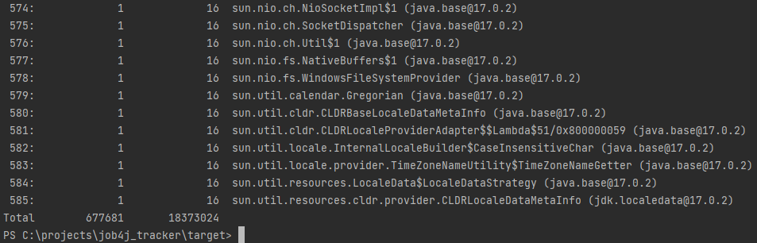

##Профилирование утилитами jmap, jstat, jconsole
#jmap
После запуска приложения, до того как были добавлены заявки, использование утилиты jmap
показало, что количество экземпляров классов в данный момент стоит на отметке 61145 шт.,
а количество занимаемой памяти 4699880 байт.

После добавления в трекер заявок в количестве 100000 шт. использование
утилиты jmap показало, что количество экземпляров классов стоит на
отметке 677681 шт., а количество занимаемой памяти 18373024 байт.

Если посмотреть на первые строчки логов, то можно заметить,
что появилось ~100000 шт. новых экземпляров классов java.base,
java.lang.String, java.time.LocalDateTime, java.time.LocalDate,
java.time.LocalTime (String, LocalDateTime, LocalDate, LocalTime
использовались при создании экземпляров класса Item) и ровно 100000 шт.
(сколько было добавлено заявок) экземпляров класса ru.job4j.tracker.Item.
В общей сложности получается ~600000 шт. новых экземпляров классов,
которые занимают ~15285600 байт. Как раз примерно на такое количество
и изменилось количество экземпляров классов и количество занимаемых
байт памяти.

#jstat
Утилита jstat запускалась до и после добавления заявок в количестве
100000 шт.

До запуска:

После запуска:

Изменения показателей, который вызывают наибольший интерес:

S1C – размер выживающей области;

S1U – размер выжившей области;

EC – размер области eden;

YGC – сборка мусора в молодом поколении;

GCT – общее время, затрачиваемое на сборку мусора.

Каждый из этих показателей вырос, что говорит о том,
что произошёл процесс сбора мусора.

#jconsole
Графики после запуска приложения:

При добавлении 500000 тысяч заявок появляется скачок на графиках
Heap Memory Usage, Classes, CPU Usage.

Это связано с инициализацией большого количество объекта.
Данная операция заполняет кучу объектами, создаются объекты типа Item,
String, LocalDateTime, LocalDate, LocalTime, как было вяснено при
использовании утилиты jmap, а так же идёт нагрузка на CPU.

При выводе всех заявок в консоль снова наблюдается скачок,
так как для вывода всех заявок создаётся копия массива заявок,
а так же запускается цикл для их вывода.

При удалении всех 500000 заявок скачок возникает в результате
проверки индекса методом приложения и методом списка в котором
находятся заявки.

